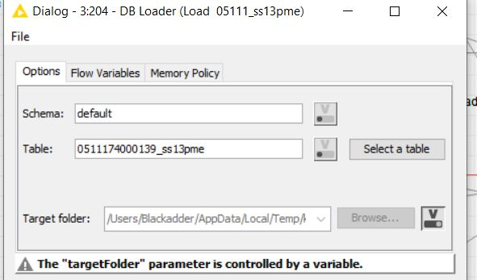
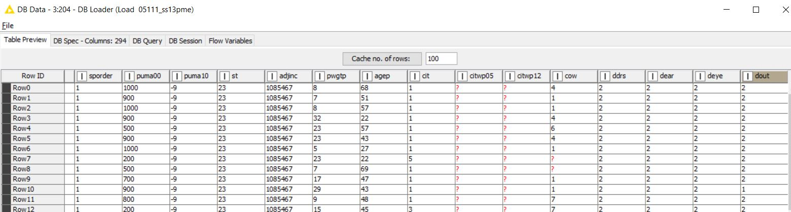
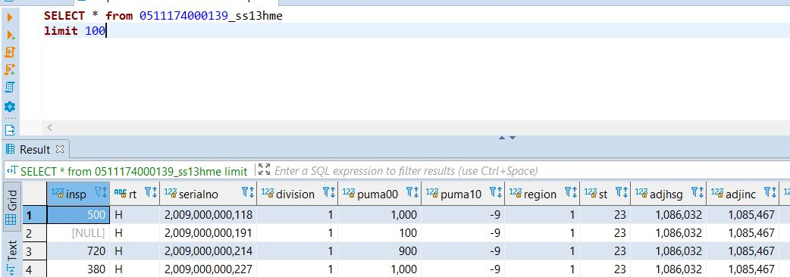
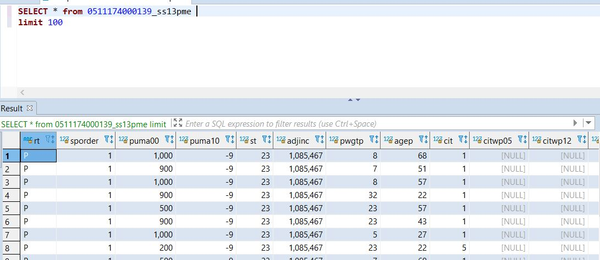
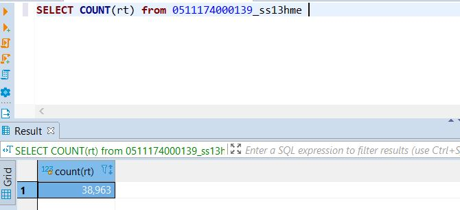
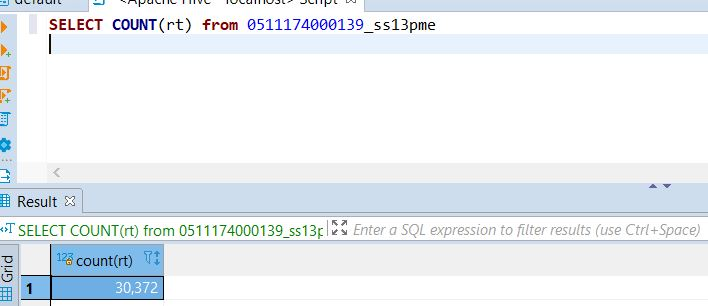

# Big Data - Tugas 2

Nama: Raden Bimo Rizki Prayogo

NRP: 0511740000139

# Exercise 1

## DB Connect

### Buat koneksi SQLite

### Select tabel

### Baca tabel

### Optional: konfigurasi koneksi

Gunakan credentials configuration untuk menset user dan password koneksi. Node ini akan menghasilkan variabel yang dapat digunakan untuk credential suatu koneksi.

## DB Processing

### Join tabel dan menghilangkan kolom

Join dengan kolom serial no dengan node DB Joiner dan filter kolom puma* dan pwgtp* dengan node Column filter denagn regex ^((?!puma|pwgtp).*)$

Hasilnya sebagai berikut:

### Filter row

Filter row dengan cow is null dengan node DB row filter dengan konfigurasi berikut:

Hasilnya adalah sebagai berikut:

### Hitung AVG agep berdasarkan sex

Gunakan node DB GroupBy dan setting sex sebagai group,agep sebagai kolom aggregasi dan AVG sebagai metode aggregasi.

Hasil:

### Optional: konfigurasi koneksi

Gunakan node-node berikut:

Sorting dengan DB Sorter dan batasi query menjadi 10 dengan DB Query.

Hasil:

## DB Modelling

Tambahkan Decison Tree Learner dan Predictor ke workflow yang sudah ada.

Berikut adalah konfigurasi yang digunakan:

berikut adalah hasilnya:

## DB Write

Gunakan node DB Write untuk membuat tabel baru dan node DB Update untuk menambahkan/ mengedit data pada suatu tabel

Hasil update:

Hasil backup:

Hasil model:

# Exercise 2

## Koneksi Hive

### Siapkan folder temp untuk dijadikan HDFS

Node Create Temp Dir membuat folder di temp sedangkan node String Manipulation mengubah penamaan folder menjadi format yang dapat diterima oleh HDFS.

### Konfigurasi koneksi spark

Node akan menghasilkan suatu koneksi sebagai berikut:

### Load Tabel ke hive

CSV reader akan membaca isi csv, kemudian table creator akan membuat table sesuai koneksi spark, kemudian DB loader akan membuat table ke DB di temp folder yang sudah didefinisikan sebelumnya

Hasilnya adalah sebagai berikut:

Di DBeaver:

## Hive Modelling

Ubah node SQLite Connector pada workflow yang disediakan menjadi node Create Local Big Data Enviroment. Pastikan sudah melakukan setup yang sudah digambar sebelumnya

Hasil:

## Hive Write

Siapkan terlebih dahulu directory HDFS denagn node Create Temp Dir seperti yang sudah dijelaskan kemudian buat tabel dengan node Tabel Creator dan commit tabel ke DB dengan node DB Loader.

Hasil:

